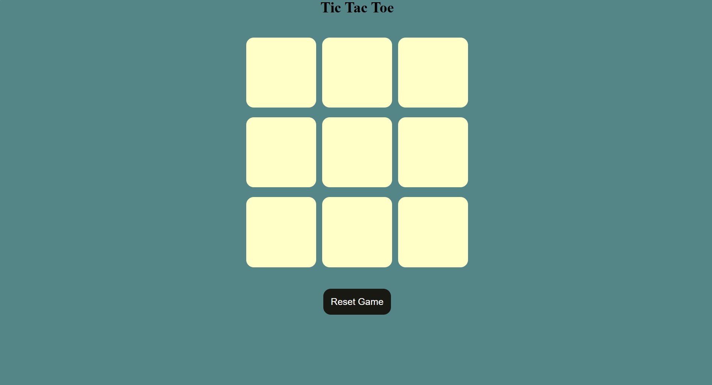
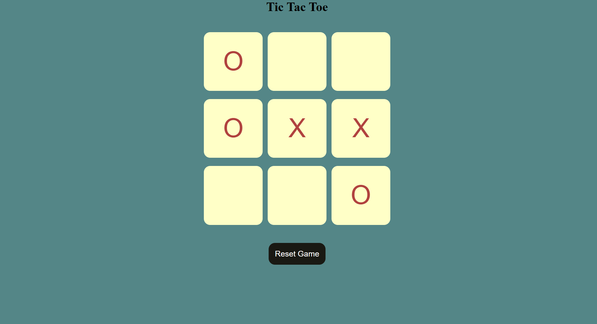
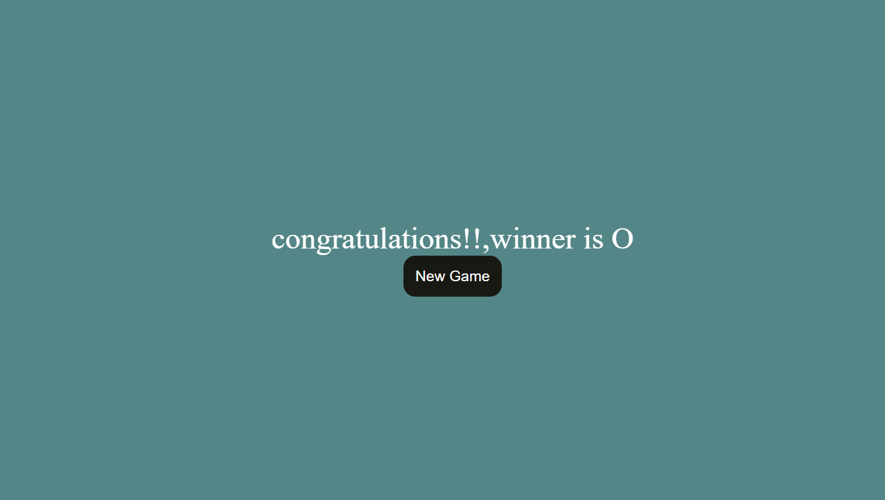

# Tic Tac Toe Game ❌⭕

A simple and interactive Tic Tac Toe game built using HTML, CSS, and JavaScript.

## Features
- Two-player gameplay
- Win and draw detection
- Interactive UI
- Responsive design
- Restart game option

## Technologies Used
- HTML
- CSS
- JavaScript

## How to Run

```bash
Open index.html
```
## Project Screenshots

### Home Screen


### Gameplay


### Winner Screen



## GitHub Repository
https://github.com/SimranBadwal2006/Tic-Tac-Toe-Game